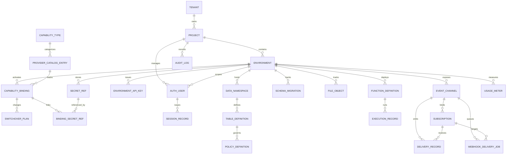

# ERD and Database Schema - Backend as a Service Platform

## Table Notes

| Table | Notes |
|-------|-------|
| `postbase_project` | Logical app workspaces under a tenant |
| `postbase_environment` | Dev/staging/prod or tenant-defined stages |
| `postbase_capability_type` | Capability taxonomy (`auth`, `data`, `storage`, `functions`, `events`) |
| `postbase_provider_catalog_entry` | Certified adapter versions and provider metadata |
| `postbase_capability_binding` | Active capability-to-provider relationships |
| `postbase_switchover_plan` | Provider migration orchestration records |
| `postbase_secret_ref` | Secret references, not raw secret material |
| `postbase_binding_secret_ref` | Many-to-many link between bindings and secret refs |
| `postbase_environment_api_key` | Environment-scoped machine credentials |
| `postbase_auth_user` | Auth facade user identities |
| `postbase_session_record` | Session lifecycle and token state |
| `postbase_data_namespace` | Schema-scoped data API metadata |
| `postbase_table_definition` | Table metadata and policy configuration |
| `postbase_policy_definition` | Policy config attached to table definitions |
| `postbase_schema_migration` | Migration/apply ledger for namespaces/tables |
| `postbase_file_object` | Provider-independent storage metadata |
| `postbase_function_definition` | Deployed function or job descriptors |
| `postbase_execution_record` | Invocation history |
| `postbase_event_channel` | Realtime or messaging namespaces |
| `postbase_subscription` | Webhook/event subscribers |
| `postbase_delivery_record` | Event delivery attempts/history |
| `postbase_webhook_delivery_job` | Durable webhook retry queue |
| `postbase_usage_meter` | Usage measurements by capability |
| `postbase_audit_log` | Immutable operational history |
