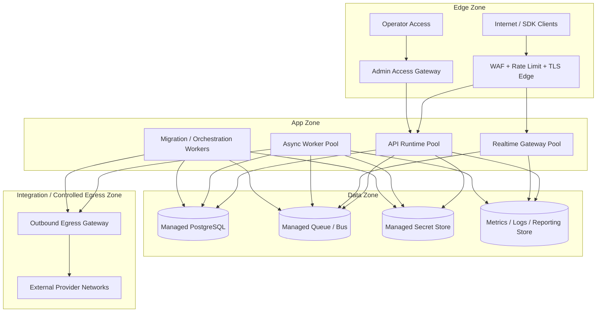

# Deployment Diagram - Backend as a Service Platform

## Deployment Notes

- API, realtime gateway, and async workers run as separate workload pools with independent autoscaling and resource quotas.
- Realtime burst handling must not consume worker capacity reserved for queue drains, migrations, or webhook delivery.
- PostgreSQL is a critical tier for metadata and core data services and stays private to app-zone callers.
- Provider-facing adapter traffic originates only from approved worker runtimes through controlled egress paths.
